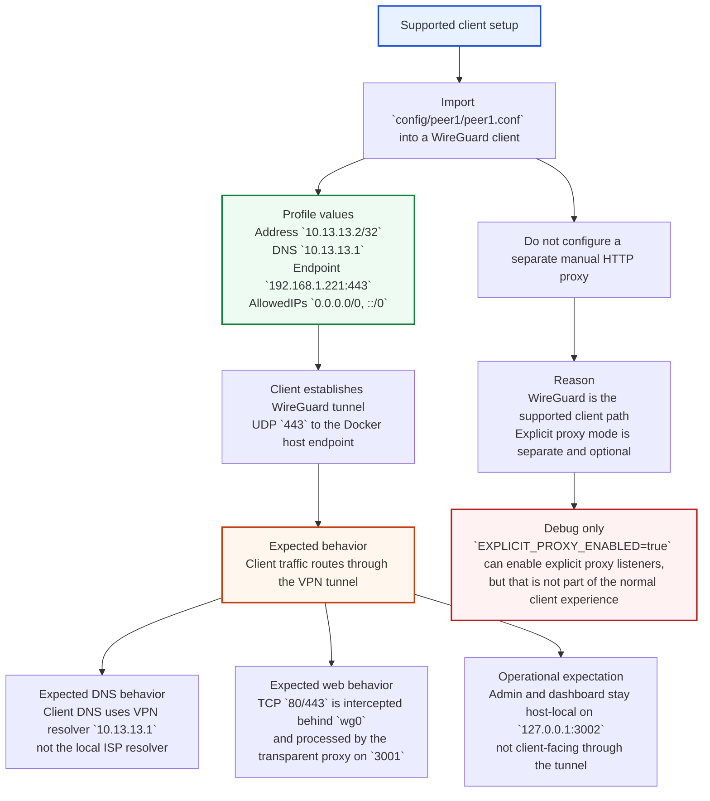

# System Architecture

## Runtime Data Plane

```mermaid
flowchart LR
    subgraph CLIENT["Client Device"]
        CI["Import `config/peer1/peer1.conf`"]
        CP["WireGuard peer\nAddress `10.13.13.2/32`\nDNS `10.13.13.1`\nAllowedIPs `0.0.0.0/0, ::/0`"]
        CA["Apps and browsers\nNo separate manual HTTP proxy"]
        CI --> CP --> CA
    end

    subgraph HOST["Docker Host"]
        HE["Host endpoint\n`192.168.1.221:443/udp`"]
        HP["Published local ports\n`127.0.0.1:3001`\n`127.0.0.1:3002`"]
    end

    subgraph CONTAINER["`ssl-proxy` Container Bootstrap + Runtime"]
        subgraph BOOT["Bootstrap"]
            BT["`docker/entrypoint.sh`"]
            BR["Render `/run/wireguard/wg0.conf`\nfrom `config/templates/server.conf`\n+ `config/server/privatekey-server`\n+ peer metadata"]
            BQ["`wg-quick up /run/wireguard/wg0.conf`"]
            BT --> BR --> BQ
        end

        subgraph WG["WireGuard Interface"]
            WGI["`wg0`\nServer address `10.13.13.1/24`\nListenPort `443`"]
            WGN["`iptables` on `%i`\nPREROUTING TCP `80/443`\nREDIRECT -> `3001`"]
            WGM["POSTROUTING MASQUERADE\nEgress via `eth+`"]
            WGI --> WGN
            WGI --> WGM
        end

        subgraph DNS["VPN DNS"]
            CD["CoreDNS listens for VPN clients\nResolver IP `10.13.13.1`"]
            CU["Cloudflare DoT upstream\n`tls://1.1.1.1`, `tls://1.0.0.1`\nSNI `cloudflare-dns.com`"]
            CD --> CU
        end

        subgraph TP["Transparent Proxy / Data Plane"]
            TPL["Transparent listener\n`0.0.0.0:3001/tcp`"]
            TPT["`src/tunnel.rs`\n`handle_transparent()`"]
            TPR["Hickory resolver in app\nRuntime DoH for upstream lookups"]
            TPO["Open upstream TCP sessions\nfor origin `80/443`"]
            TPL --> TPT --> TPR --> TPO
        end

        subgraph ADMIN["Admin Surface"]
            AH["Health + dashboard\n`0.0.0.0:3002/tcp`\nHost-local publish only"]
        end

        subgraph LEGACY["Legacy Explicit Proxy Branch"]
            LX["`EXPLICIT_PROXY_ENABLED=false`\nby default"]
            LP["Explicit proxy `3000/tcp`\nonly when enabled"]
            LQ["QUIC/H3 explicit proxy\nonly when enabled with TLS"]
            LN["Plain HTTP CONNECT is debug-only\nand not the recommended client path"]
            LX --> LP
            LX --> LQ
            LP --> LN
        end
    end

    subgraph ORIGIN["Internet Origins"]
        O1["HTTPS / HTTP origin servers"]
    end

    CP -->|"UDP 443 tunnel"| HE -->|"into container"| BQ
    WGI -->|"VPN client DNS queries"| CD
    CA -->|"All client traffic enters tunnel"| WGI
    WGN -->|"Redirect TCP 80/443"| TPL
    TPO -->|"Egress to origins"| O1
    WGM -->|"SNAT / return path"| O1
    HP --> AH

    style CLIENT fill:#e8f1ff,stroke:#4f46e5,stroke-width:2px
    style HOST fill:#eefbf2,stroke:#15803d,stroke-width:2px
    style CONTAINER fill:#fff7ed,stroke:#c2410c,stroke-width:2px
    style ORIGIN fill:#f5f3ff,stroke:#7c3aed,stroke-width:2px
```

## Client Expectations



## Port Assignments

| Service | Port | Protocol | Purpose |
|---------|------|----------|---------|
| WireGuard VPN | 443 | UDP | External tunnel endpoint |
| Transparent Proxy | 3001 | TCP | Internal listener for redirected WireGuard traffic |
| Admin API + Dashboard | 3002 | TCP | Internal health, dashboard, and stats surface |
| Explicit Proxy | 3000 | TCP | Legacy opt-in listener, disabled by default |

## Component Startup Order

1. **CoreDNS** - Initializes the VPN DNS resolver and forwards upstream over DNS-over-TLS
2. **WireGuard** - Creates `wg0` TUN interface via kernel module and establishes the encrypted client path
3. **ssl-proxy** - Starts transparent interception, obfuscation, and audit logging for tunneled traffic

## Obfuscation Profiles

Traffic is normalized per domain classification to prevent fingerprinting.

### Active Profiles

- **fox-news**: Fox News domain family
- **fox-sports**: Fox Sports domain family

### Applied Modifications

**Request Headers**
✅ Removes `X-Forwarded-For`, `Via`, `Forwarded` proxy headers
✅ Strips `DNT`, `Sec-GPC` privacy signals
✅ Normalizes User-Agent to configured standard value

**Response Headers**
✅ Removes `X-Cache`, `X-Edge-IP`, `X-Served-By` CDN leak headers
✅ Preserves security headers (CSP, HSTS)

Domain matching supports wildcard subdomains and is case-insensitive.

---

## Quick Start

1. **Setup secrets:**
   ```bash
   mkdir -p secrets
   echo "your-oracle-password" > secrets/oracle_password.txt
   ```

2. **Start stack:**
   ```bash
   docker compose up -d
   ```

3. **WireGuard Client Configuration:**
   Use the generated client config at `config/peer1/peer1.conf`. This is the supported client setup and can be imported directly into any WireGuard client application. Do not combine it with a separate manual HTTP proxy on the client.

   Verify the service locally:
   ```bash
   curl -i http://127.0.0.1:3002/health
   ```

## Legacy Explicit Proxy Mode

The explicit HTTP/HTTPS proxy path is retained only for controlled debugging. It must be enabled explicitly with `EXPLICIT_PROXY_ENABLED=true`, and plaintext HTTP proxy mode still exposes `CONNECT host:443` metadata on the client-to-proxy leg.
